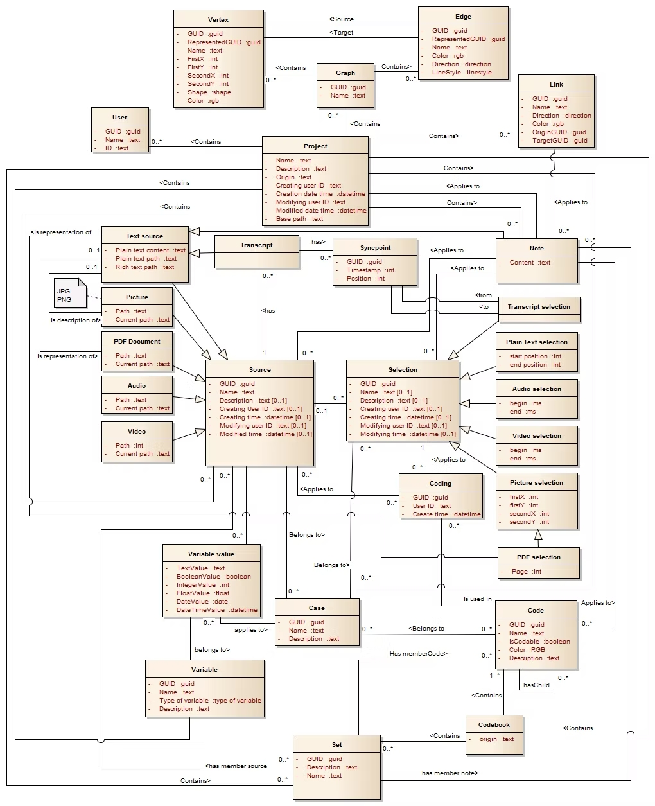

# Organização dos dados exportados pelo Atlas.ti

Para anotar e analisar os dados coletados na pesquisa, o GPP utiliza o software Atlas.ti. O programa permite a exportação 
completa de um projeto de maneira estruturada.

## Exportação do Atlas.ti

O arquivo exportado pelo Atlas.ti é gerado no formato `.qdpx`, que é o padrão definido pela [Rotterdam Exchange Format Initiative (REFI)](https://www.qdasoftware.org/),
para garantir a interoperabilidade entre diferentes softwares de análise qualitativa.

>[!NOTE]
> As informações abaixo são baseadas em exportação do Atlas.ti realizada em 2023 e disponibilizada para a Páramo Software. 
> A estrutura e os detalhes do podem ser alterados com atualizações do software.

## Estrutura do arquivo exportado (.qdpx)

O arquivo `.qdpx` pode ser extraído como um arquivo ZIP. Ao ser extraído, tem-se a seguinte estrutura de diretórios:

    ```
    nome_do_export
    ├── sources
    │   ├── source1.txt
    │   ├── source1.docx
    │   ├── source3.m4a
    │   └── ...
    ├── project.qde
    ```

- `sources`: contém os arquivos fonte (textos, documentos, etc.) utilizados na análise. Cada fonte é identificada por um GUID (identificador único global),
que pode ser repetido para a mesma fonte em diferentes formatos (por exemplo, texto e DOCX).
- `project.qde`: arquivo principal no formato _Qualitative Data Exchange_ (QDE), que contém os dados estruturados em XML.

## Modelo de dados do arquivo `project.qde`

O arquivo `project.qde` é um arquivo XML que contém a estrutura do projeto e as informações sobre as anotações realizadas. Abaixo está um exemplo esquemático da estrutura do XML:

```xml
<Project origin="Atlas.ti" name="nome_do_export" creatingUserGUID="B27E9088" creationDateTime="YYYY-MM-DDTHH:MM:SSZ" modifyingUserGUID="B27E9088" modifiedDateTime="YYYY-MM-DDTHH:MM:SSZ" xmlns="urn:QDA-XML:project:1.0">
    <Users>
        <User guid="B27E9088" name="Usuário 1" />
        <User guid="C4E79FCB" name="Usuário 2" />
        <!-- ... -->
    </Users>
    <CodeBook>
        <Code guid="0050AEC3" name="Código 1" isCodeble="true" color="#FF0000" />
        <Code guid="A680AEC3" name="Código 2" />
        <Code guid="B9G0AAC6" name="Código 3" isCodeble="true" color="#00FF00">
            <Description>Descrição do Código 3</Description> 
        </Code>
        <Code guid="A6BC8B2" name="Código 4" isCodeble="true" color="#0000FF">
            <Description>Descrição do Código 4</Description>
            <Code guid="B9G0AAC6" name="Código 4.1" isCodeble="true" color="#FFFF00">
                <Description>Descrição do Código 4.1, parte do Código 4</Description>
            </Code>
        </Code>
        <!-- ... -->
    </CodeBook>
    <Sources>
        <TextSource name="name1" plainTextPath="internal://source1.txt" richTextPath="internal://source1.docx" creatingUser="B27E9088"  modifyingUser="B27E9088" creationDateTime="YYYY-MM-DDTHH:MM:SSZ" modifiedDateTime="YYYY-MM-DDTHH:MM:SSZ">
            <Description>Descrição da fonte de texto</Description>
            <PlainTextSelection guid="91575042" name="snippet selection" startPosition="0" endPosition="1010" creatingUser="B27E9088" creationDateTime="YYYY-MM-DDTHH:MM:SSZ">
                <Description>Descrição da seleção de texto</Description>
                <Coding guid="8F2E7E5A" creatingUser="B27E9088" creationDateTime="YYYY-MM-DDTHH:MM:SSZ">
                    <CodeRef targetGUID="0050AEC3" />
                </Coding>
                <Coding guid="851E492C" creatingUser="C4E79FCB" creationDateTime="YYYY-MM-DDTHH:MM:SSZ">
                    <CodeRef targetGUID="A680AEC3" />
                </Coding>
                <!-- ... -->
            </PlainTextSelection>
            <PlainTextSelection guid="47B2AB4D" name="snippet selection 2" startPosition="104" endPosition="506" creatingUser="B27E9088" creationDateTime="YYYY-MM-DDTHH:MM:SSZ">
                <Coding guid="9809AD1A" creatingUser="B27E9088" creationDateTime="YYYY-MM-DDTHH:MM:SSZ">
                    <CodeRef targetGUID="B9G0AAC6" />
                </Coding>
                <!-- ... -->
                <NoteRef targetGUID="04EA5FEE" />
            </PlainTextSelection>
            <!-- ... -->
        </TextSource>
        <AudioSource path="relative:///audio1.m4a" guid="9D260347" name="entrevista.m4a" modifiedDateTime="YYYY-MM-DDTHH:MM:SSZ" modifyingUser="B27E9088" creatingUser="B27E9088" creationDateTime="YYYY-MM-DDTHH:MM:SSZ">
            <Description>Descrição da fonte de áudio</Description>
            <Transcript plainTextPath="internal://C8A57C71.txt" richTextPath="internal://1DDD235C.docx" guid="71013825" name="entrevista detalhe.docx"  modifyingUser="B27E9088" modifiedDateTime="YYYY-MM-DDTHH:MM:SSZ" creatingUser="B27E9088" creationDateTime="YYYY-MM-DDTHH:MM:SSZ">
                <SyncPoint guid="3101C58C" position="55" timeStamp="15630" />
                <SyncPoint guid="5F26FA5B" position="123" timeStamp="650" />
                <!-- ... -->
                <TranscriptSelection guid="467362C5" name="Entrevista detalhe 1" fromSyncPoint="3101C58C" toSyncPoint="5F26FA5B">
                    <Description>Commentário sobre o TU 1</Description>
                    <Coding guid="C4BAD35E" creatingUser="B27E9088" creationDateTime="YYYY-MM-DDTHH:MM:SSZ">
                        <CodeRef targetGUID="B9G0AAC6" />
                        <NoteRef targetGUID="A6BC8B2" />
                    </Coding>
                    <Coding guid="367DD20E" creatingUser="B27E9088" creationDateTime="YYYY-MM-DDTHH:MM:SSZ">
                        <CodeRef targetGUID="B9G0AAC6" />
                    </Coding>
                    <NoteRef targetGUID="04EA5FEE" />
                    <!-- ... -->
                </TranscriptSelection>
            </Transcript>
            <AudioSelection guid="238965CB" name="00:16.17 – 00:45.35" begin="16176" end="45358" modifyingUser="B27E9088" creatingUser="AB27E9088" creationDateTime="YYYY-MM-DDTHH:MM:SSZ" modifiedDateTime="YYYY-MM-DDTHH:MM:SSZ">
                <Coding guid="A6BC8B2" creatingUser="B27E9088" creationDateTime="YYYY-MM-DDTHH:MM:SSZ">
                    <CodeRef targetGUID="0050AEC3"/>
                </Coding>
                <!-- ... -->
            </AudioSelection>
            <!-- ... -->
        </AudioSource>
    </Sources>
    <Notes>
        <Note guid="04EA5FEE" name="IT24" plainTextPath="internal://note1.txt" richTextPath="internal://note1.docx" creatingUser="B27E9088" creationDateTime="YYYY-MM-DDTHH:MM:SSZ" modifyingUser="B27E9088" modifiedDateTime="YYYY-MM-DDTHH:MM:SSZ" />
        <Note guid="A6BC8B2" name="AF89" plainTextPath="internal://note2.txt" richTextPath="internal://note2.docx" creatingUser="C4E79FCB" creationDateTime="YYYY-MM-DDTHH:MM:SSZ" modifyingUser="C4E79FCB" modifiedDateTime="YYYY-MM-DDTHH:MM:SSZ" />
        <!-- ... -->
    </Notes>
    <Links>
        <Link guid="998DED36" name="está associado com" color="#000000" direction="Bidirectional" originGUID="0050AEC3" targetGUID="B9G0AAC6" />
        <Link guid="F41D6C99" name="está associado com" color="#000000" direction="Bidirectional" originGUID="A680AEC3" targetGUID="B9G0AAC6" />
        <!-- ... -->
    </Links>
    <Sets>
        <Set guid="C4E79FCB" name="Tags de persuasão" >
            <Description>Conjunto de códigos relacionados à persuasão</Description>
            <MemberCode targetGUID="0050AEC3" />
            <MemberCode targetGUID="A680AEC3" />
            <!-- ... -->
        </Set>
        <Set guid="91C0F928" name="Corpus inicial">
            <MemberSource targetGUID="91575042" />
            <MemberSource targetGUID="47B2AB4D" />
            <!-- ... -->
        </Set>
        <!-- ... -->
    </Sets>
</Project>
```

### Descrição dos elementos principais

#### Atributos comuns
Alguns atributos são comuns a vários elementos do XML, descritos aqui e somente referenciados nos elementos específicos:
- `guid`: identificador único global (GUID) do elemento, no formato XXXXXXXX-XXXX-XXXX-XXXX-XXXXXXXXXXXX.
- `name`: nome do elemento (geralmente um nome descritivo ou título).
- `creatingUser`: GUID do usuário criador do elemento.
- `modifyingUser`: GUID do usuário que modificou o elemento pela última vez.
- `creationDateTime`: data e hora de criação do elemento, no formato ISO 8601 (YYYY-MM-DDTHH:MM:SSZ).
- `modifiedDateTime`: data e hora da última modificação do elemento, no formato ISO 8601 (YYYY-MM-DDTHH:MM:SSZ).
- `plainTextPath`: caminho para o arquivo de texto simples associado ao elemento.
- `richTextPath`: caminho para o arquivo de texto rico (ex. DOCX) associado ao elemento.

#### Project
Elemento raiz do XML, contendo informações gerais sobre o projeto. Possui os atributos:
- `origin`: nome do software de origem da exportação (ex. "Atlas.ti").
- `name`
- `creatingUserGUID`
- `modifyingUserGUID`
- `creationDateTime`
- `modifiedDateTime`

#### Users
Lista de usuários membros do projeto.

##### User
Cada usuário possui os atributos:
- `guid`
- `name`

#### CodeBook
Lista de códigos utilizados no projeto, representados pelo elemento `<Code>`.

##### Code
Cada código possui os atributos:
- `guid`
- `name`
- `isCodeble`: indica se o código pode ser aplicado a codificações (true/false).
- `color`: cor opcional associada ao código (em formato hexadecimal).

Opcionalmente, pode conter uma descrição, representada pelo elemento `<Description>`.
Códigos podem ser hierarquicamente organizados por meio de elementos `<Code>` aninhados, permitindo a inclusão de subcódigos.

#### Sources
Lista de fontes analisadas no projeto, representadas pelos elementos `<TextSource>`, `<PDFSource>`, `<AudioSource>`, `<VideoSource>` e `<PictureSource>`. 

##### TextSource
Cada fonte pode ter seleções de texto codificadas, representadas pelo elemento `<TextSource>`, que possui os atributos:
- `name`
- `plainTextPath`
- `richTextPath`
- `creatingUser`
- `modifyingUser`
- `creationDateTime`
- `modifiedDateTime`

Opcionalmente, pode conter uma descrição, representada pelo elemento `<Description>`.

###### PlainTextSelection
Cada fonte pode conter seleções de texto codificadas, representadas pelo elemento `<PlainTextSelection>`, que possuí os atributos:
- `guid`
- `name`
- `startPosition`: posição inicial da seleção no texto.
- `endPosition`: posição final da seleção no texto.

Opcionalmente, pode conter uma descrição, representada pelo elemento `<Description>`.

##### AudioSource
Está prevista a possibilidade de incluir fontes de áudio, mas não foi utilizado no projeto disponibilizado. Possui os atributos:
- `name`
- `path`
- `guid`
- `modifyingUser`
- `creatingUser`
- `creationDateTime`
- `modifiedDateTime`

Opcionalmente, pode conter uma descrição, representada pelo elemento `<Description>`.

##### AudioSelection
Cada fonte de áudio pode conter seleções de áudio codificadas, representadas pelo elemento `<AudioSelection>`, que possui os atributos:
- `guid`
- `name`
- `begin`: posição inicial da seleção no áudio.
- `end`: posição final da seleção no áudio.
- `modifyingUser`
- `creatingUser`
- `creationDateTime`
- `modifiedDateTime`

Opcionalmente, pode conter uma descrição, representada pelo elemento `<Description>`.

###### Transcript
Cada fonte de áudio pode conter transcrições, representadas pelo elemento `<Transcript>`, que possui os atributos:
- `plainTextPath`
- `richTextPath`
- `guid`
- `name`
- `modifyingUser`
- `creatingUser`
- `creationDateTime`
- `modifiedDateTime`

Opcionalmente, pode conter uma descrição, representada pelo elemento `<Description>`.

###### SyncPoint
Cada transcrição pode conter pontos de sincronização entre uma posição no texto e um timestamp no áudio, representados pelo elemento `<SyncPoint>`. Possui os atributos:
- `guid`: identificador único do ponto de sincronização.
- `position`: posição no texto da transcrição onde o ponto de sincronização está localizado.
- `timeStamp`: timestamp do ponto de sincronização no áudio, em milissegundos.

###### TranscriptSelection
As transcrições podem conter seleções de texto codificadas, representadas pelo elemento `<TranscriptSelection>`, que possui os atributos:
- `guid`
- `name`
- `fromSyncPoint`: GUID do ponto de sincronização inicial.
- `toSyncPoint`: GUID do ponto de sincronização final.

Opcionalmente, pode conter uma descrição, representada pelo elemento `<Description>`.

#### VideoSource
Segue a mesma estrutura do `<AudioSource>`, mas para fontes de vídeo. Não foi utilizado no projeto disponibilizado.

##### Coding
Cada seleção, seja de texto, áudio, transcrição ou vídeo, pode conter codificações, representadas pelo elemento `<Coding>`. Possui os atributos:
- `guid`
- `creatingUser`
- `creationDateTime`

###### CodeRef
Cada codificação pode conter um elemento `<CodeRef>`, que referencia o código aplicado, com os atributos:
- `targetGUID`: GUID do código aplicado.

#### Notes
Lista de notas ou comentários, representados pelo elemento `<Note>`. 

##### Note
Cada nota possui os seguintes atributos e pode estar associada aos elementos pelo `<NoteRef>`:
- `guid`
- `name`
- `plainTextPath`
- `richTextPath`
- `creatingUser`
- `creationDateTime`
- `modifyingUser`
- `modifiedDateTime`

#### Links
Lista de links entre códigos, representados pelo elemento `<Link>`.

##### Link
Define relações entre códigos. Possui atributos:
- `guid`
- `name`
- `color`: cor opcional associada ao link (em formato hexadecimal).
- `direction`: direção do link, que pode ser "Bidirectional" (bidirecional) ou "OneWay" (unidirecional) "Associative" (associativo).
- `originGUID`: GUID do código de origem do link. 
- `targetGUID`: GUID do código de destino do link.

#### Sets
Lista de conjuntos de códigos ou fontes. Cada conjunto é representado pelo elemento `<Set>`.

##### Set
Cada conjunto possui os seguintes atributos:
- `guid`
- `name`

Opcionalmente, pode conter uma descrição, representada pelo elemento `<Description>`.

###### MemberCode/MemberSource
Cada conjunto pode conter referências a códigos ou fontes, representadas pelos elementos `<MemberCode>` e `<MemberSource>`, respectivamente. Esses elementos possuem o atributo:
- `targetGUID`: GUID do código ou fonte associado ao conjunto.

## Diagrama do modelo de dados
O diagrama abaixo descreve a estrutura completa do modelo de dados:



## Referências
- [QDA Software - Rotterdam Exchange Format Initiative (REFI)](https://www.qdasoftware.org/)